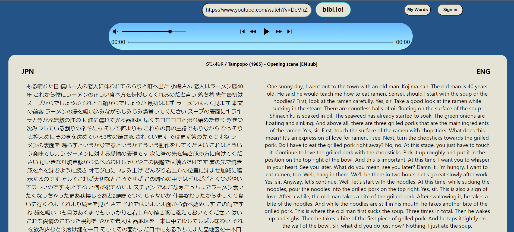

<p align="center">
    <a href=""></a>
    <a href=""></a>
    <a href=""></a>
    <br>
    <a href=""></a>
    <a href=""></a>
    <a href="https://docs.python.org/3/index.html"></a>
    <a href=""></a>
    <a href=""></a>
    <a href=""></a>
    <br>
    <a href=""></a>
    <a href=""></a>
    <a href=""></a>
    <a href=""></a>
    <a href=""></a>
</p>

<h1 align="center"><b>bibl.io</b></h1>
<h4 align="center">A full-stack web app that serves as a language learning tool to turn any YouTube video into a learning resource. </h4>

<p align="center">
    
</p>

## Table of Contents

- [Introduction](#introduction)
- [Technical Requirements](#technical-requirements)
- [Project Structure](#project-structure)
- [Key Functionalities](#key-functionalities)
- [Project Features](#project-features)
- [Getting Started](#getting-started)
- [Usage](#usage)
- [Dependencies](#dependencies)
- [Contributing](#contributing)
- [License](#license)

## Introduction

bibl.io is a language learning tool that provides users a way to turn any YouTube video into a learning resource. By simply inserting a YouTube url the user receives an mp3 ready for playback as well as a transcription and translation to study from. bibl.io harnesses the power of the OpenAI Whisper API to provide powerful language tools.

## Technical Requirements

To run bibl.io locally, you need the following:

- Python 3.7 or later

## Project Directory Hierarchy

Upon successful setup (see **Getting Started**), you should see the following project directory hierarchy.

```
bibl.io/
├── flask/
│ └── app.py
│ └── mongo.py
│ └── converter.py
│ └── transcription.py
│ └── translation.py
├── lingo/
│ └── src/
│ │   └──
│ └── 
├── server/
└── README.md
```
