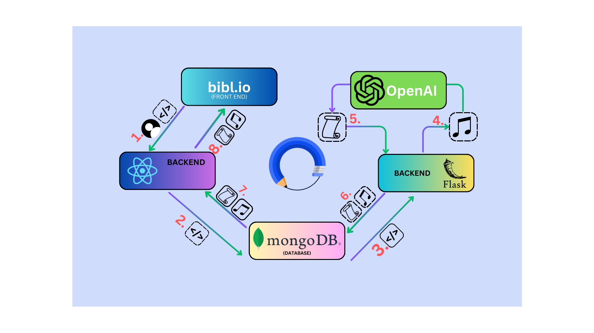

<p align="center">
    <a href=""></a>
    <a href=""></a>
    <a href=""></a>
    <br>
    <a href=""></a>
    <a href=""></a>
    <a href="https://docs.python.org/3/index.html"></a>
    <a href=""></a>
    <a href=""></a>
    <a href=""></a>
    <br>
    <a href=""></a>
    <a href=""></a>
    <a href=""></a>
    <a href=""></a>
    <a href=""></a>
</p>

<h1 align="center"><b>bibl.io</b></h1>
<h4 align="center">A full-stack web app that serves as a language learning tool to turn any YouTube video into a learning resource. </h4>

<p align="center">
    
</p>

## Table of Contents

- [Introduction](#introduction)
- [Technical Requirements](#technical-requirements)
- [Project Structure](#project-structure)
- [Key Functionalities](#key-functionalities)
- [Getting Started](#getting-started)
- [Usage](#usage)
- [Dependencies](#dependencies)
- [Contributing](#contributing)
- [License](#license)

## Introduction

bibl.io is a language learning tool that provides users a way to turn any YouTube video into a learning resource. By simply inserting a YouTube url the user receives an mp3 ready for playback as well as a transcription and translation to study from. bibl.io harnesses the power of the OpenAI Whisper API to provide powerful language tools.

## Technical Requirements

To run bibl.io locally, you need the following:

- Python 3.7 or later

## Project Directory Hierarchy

Upon successful setup (see **Getting Started**), you should see the following project directory hierarchy.

```
bibl.io/
├── flask/
│ └── app.py
│ └── mongo.py
│ └── converter.py
│ └── transcription.py
│ └── translation.py
├── lingo/
│ └── src/
│ │   └── components/
│ │   │   └── ContainerHead.jsx
│ │   │   └── Footer.jsx
│ │   │   └── Header.jsx
│ │   │   └── LanguageDropdown.jsx
│ │   │   └── MyWords.jsx
│ │   │   └── Player.jsx
│ │   │   └── SignIn.jsx
│ │   │   └── SignOut.jsx
│ │   │   └── Transcription.jsx
│ │   │   └── Translation.jsx
│ │   │   └── WordContainer.css
│ │   └── screens/
│ │       └── LandingPage/
│ │           └── LandingPage.js
│ │       └── LoginScreen/
│ │           └── LoginScreen.css
│ │           └── LoginScreen.js
│ │       └── RegisterScreen/
│ │           └── RegisterScreen.css
│ │           └── RegisterScreen.js
│ └── App.css
│ └── App.js
│ └── Index.css
│ └── Index.js
├── server/
│ └── controllers/
│ │   └── userControllers.js
│ └── middlewares/
│ │   └── errorMiddleware.js
│ └── models/
│ │   └── Audio.js
│ │   └── Transcription.js
│ │   └── Translation.js
│ │   └── Url.js
│ │   └── User.js
│ │   └── Wordlist.js
│ └── routes/
│ │   └── userRoutes.js
│ └── utils/
│ │   └── generateToken.js
│ └── index.js
└── README.md
```
- `flask/`: Directory containing backend logic and python files that are sent directly to OpenAI Whisper API.
- `lingo/`: Directory containing the frontend React logic which communicates with the React `server/`.
- `server/`: Directory containing the backend React logic which communicates to MongoDB as well as the frontend. 
- `README.md`: Project documentation providing an overview, setup instructions, and other details.

<p align="center">
    
</p>

## Key Functionalities

bibl.io offers the following functionalities:

- Insert any YouTube URL into the search bar and click bibl.io!
- The URL is converted to an mp3 and supplied to the media player.
- The mp3 is fed into the Whisper API where it is converted into a transcription and translation.
- The transcription and translation are rendered on the page.
- Log in functionality with JWT is supported.
- Users can register and their credentials are safely encrypted with bcrypt.

## Getting Started

1. Clone this repository to your local machine:

```bash
git clone https://github.com/P-Draper/bibl.io.git
```

2. Navigate to the project directory:

```bash
cd project
```
2A. In one terminal navigate to the flask directory and pip install:

```bash
cd flask
pip install
```
2B. In one terminal navigate to the lingo directory and npm install:

```bash
cd lingo
npm install
```
2C. In one terminal navigate to the server directory and npm install:

```bash
cd server
npm install
```

3. Run servers in each respective directory:

flask/:
```bash
python app.py
```

lingo/ and server/:
```bash
npm start
```

## Usage

1. Insert a YouTube URL.
2. Play the corresponding mp3 in the media player.
3. Follow along with the transcription and translation.
4. Insert words you may struggle with into your word list to remind yourself of later.
5. Create a user.
6. Login and logout.

## Dependencies

bibl.io relies on the following libraries:
- React
- Express.js
- Axios
- Mongoose
- pymongo
- gridfs

## Contributing

Contributions to bibl.io are welcome! If you encounter any issues, have feature suggestions, or would like to contribute code, please open an issue or pull request on the GitHub repository.

## License

MIT License

Copyright (c) 2023 Peter Draper

Permission is hereby granted, free of charge, to any person obtaining a copy
of this software and associated documentation files (the "Software"), to deal
in the Software without restriction, including without limitation the rights
to use, copy, modify, merge, publish, distribute, sublicense, and/or sell
copies of the Software, and to permit persons to whom the Software is
furnished to do so, subject to the following conditions:

The above copyright notice and this permission notice shall be included in all
copies or substantial portions of the Software.

THE SOFTWARE IS PROVIDED "AS IS", WITHOUT WARRANTY OF ANY KIND, EXPRESS OR
IMPLIED, INCLUDING BUT NOT LIMITED TO THE WARRANTIES OF MERCHANTABILITY,
FITNESS FOR A PARTICULAR PURPOSE AND NONINFRINGEMENT. IN NO EVENT SHALL THE
AUTHORS OR COPYRIGHT HOLDERS BE LIABLE FOR ANY CLAIM, DAMAGES OR OTHER
LIABILITY, WHETHER IN AN ACTION OF CONTRACT, TORT OR OTHERWISE, ARISING FROM,
OUT OF OR IN CONNECTION WITH THE SOFTWARE OR THE USE OR OTHER DEALINGS IN THE
SOFTWARE.
